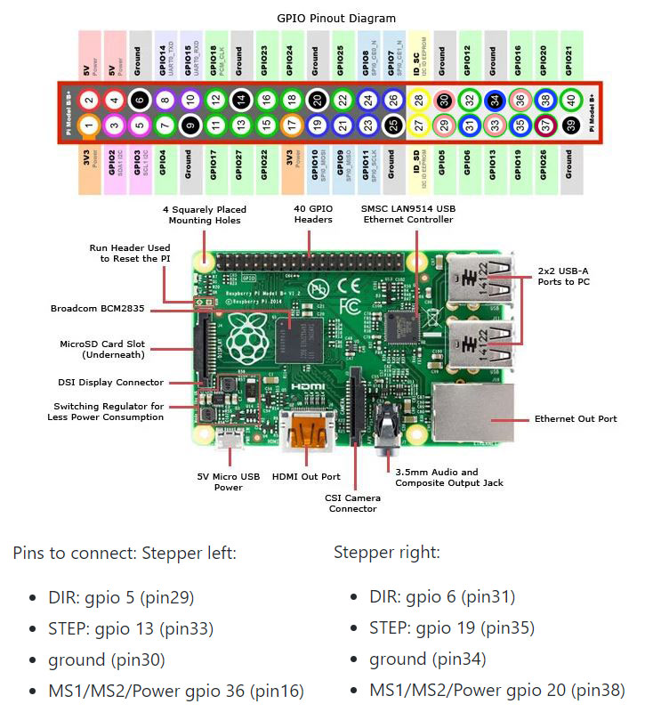
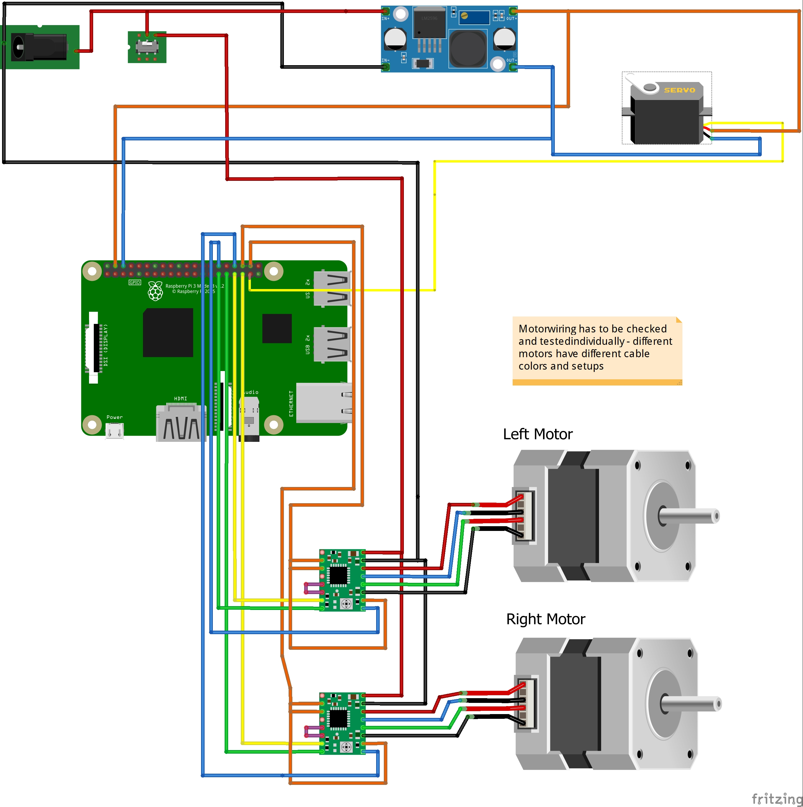

# Drawbot ✏️

Drawing robot capable of rendering SVG paths over WebSockets. Powered by a Raspberry Pi running Node.js.
This project is heavily inspired by https://github.com/andywise/drawbot and several other wall hanging drawing robots

## Parts List
If you want to build one on your own, check out the readme of andywises repository. I will only document mine and my changes here

### Printable Parts

### Everything Else
The Stepper controllers used are doing 1/8 microstepping by default (took me a while till i found this out)
As i have a slightly different hardware, the circumfence of my spools - therefore i had to change the mm per step value in config.json  ("stepsPerMM": [ )

SVG HINTS:
The whole artwork should be in one group
Text has to be converted to paths

INKSCAPE HINTS:
Export with ABSOLUTE path format: Settings > Iput/output > SVG-output...
Ungroup everything and regroup -> all coordinates get recalculated (otherwise there is a translation matrix in the svg which is not interpreted by the drawbot and the artwork is probably at the wrong place and has the wrong size)
Units should always be PIXELS -> the drawbot makes 1px to 1mm

## Wiring

 
 

## Hardware Assembly

Instead of using a Raspberry Pi zero W i decided to go for a 3B+ because manipulating and rendering complex svg paths in nodeJS is almost impossible on a zero w
-> pinouts and wiring are different here (wiring jpg to be updated)

## Raspberry Pi 3B+ Setup
1. **Download and install [Etcher](https://etcher.io/)**.
2. **Download and install latest [Raspbian OS](https://www.raspberrypi.org/downloads/raspbian/)** and flash it onto your SD card with Etcher.
3. **Enable SSH** by adding a blank file named `ssh` (no extension) to the `boot` directory on the Pi's SD card. (Last tested with Raspbian Stretch Lite 2018-06-27 version.)
4. **Set up Wifi** by adding a file named `wpa_supplicant.conf` to the same `boot` directory with the following contents (replace `MySSID` and `MyPassword` with your credentials):  
	```
	ctrl_interface=DIR=/var/run/wpa_supplicant GROUP=netdev
	update_config=1
		
	network={ 
		ssid="MySSID" 
		psk="MyPassword" 
	}
	```

## Software Prerequisites
From a device connected to the same network as the Drawbot Pi, SSH into the Pi with `ssh pi@raspberrypi.local`. The default password is `raspberry`.

Then, on the Drawbot Pi:

1. **Update, upgrade, and install NPM, Git.** (Automatically answer "yes" to everything.):
	* `sudo apt-get update`
	* `sudo apt-get upgrade`
	* `sudo apt-get install npm`
	* `sudo apt-get install git`

2. **Install Node.js.**
	* `sudo npm install -g n` (Install **n** for node.js version management. [github.com/tj/n](https://github.com/tj/n))
	* `sudo n stable` (Install latest stable version of Node.js. Last tested with v10.8.0)

3. **Upgrade NPM.** (and remove old apt-get version).
	* `sudo npm install npm@latest -g`
	* `sudo apt-get remove npm`
	* `sudo reboot` (After rebooting, you'll have to SSH into the Pi again.)

4. **Install pigpio C library.** [npmjs.com/package/pigpio](https://www.npmjs.com/package/pigpio)
	* `sudo apt-get install pigpio` (Only if you're using Raspbian *Lite*.)
	* `npm install pigpio`

## Installation
On the Drawbot Pi:

1. `git clone https://github.com/captfuture/drawbot.git` to clone this repository.
2. `cd drawbot`
3. `npm i`

## Use
On the Drawbot Pi:

* Run `npm start` or `sudo node draw.js` to start the Drawbot controller.

## Controlling the Drawbot
On a device connected to the same local network as the Drawbot Pi:

* Go to [raspberrypi.local/control](http://raspberrypi.local/control) to access the Drawbot control interface.
* Use the "bullseye" interface to manually position the gondola, or raise/lower the pen/marker.
* Use the settings panel to configure the Drawbot's `D`, `X`, and `Y` values (see "Configuration" below).
* Drag and drop an SVG file onto the control interface to send artwork to the Drawbot!

### SVG Artwork Notes:
* The Drawbot will scale artwork so that **1 pixel = 1 millimeter**.

## Configuration
* **Enter value for `D`:** measure distance between string starting points (in millimeters).
* **Enter starting `X` and `Y` values:** measure distance from left and top (respectively) of left string starting point to initial pen position (also in mm).
* Note: Values will be stored in the `config.json` file.

## 3.2´´ LCD screen
```
sudo rm -rf LCD-show
git clone https://github.com/goodtft/LCD-show.git
chmod -R 755 LCD-show
cd LCD-show/
sudo ./LCD32-show
If you need to switch back to the traditional HDMI display
sudo ./LCD-hdmi
```

## Rendering Raster Artwork 
* https://github.com/jwcliff/Drawbot_image_to_gcode_v2
* https://github.com/evil-mad/stipplegen 
*** https://github.com/postspectacular/toxiclibs
*** http://www.sojamo.de/libraries/controlP5/

* https://overflower.bleeptrack.de/

